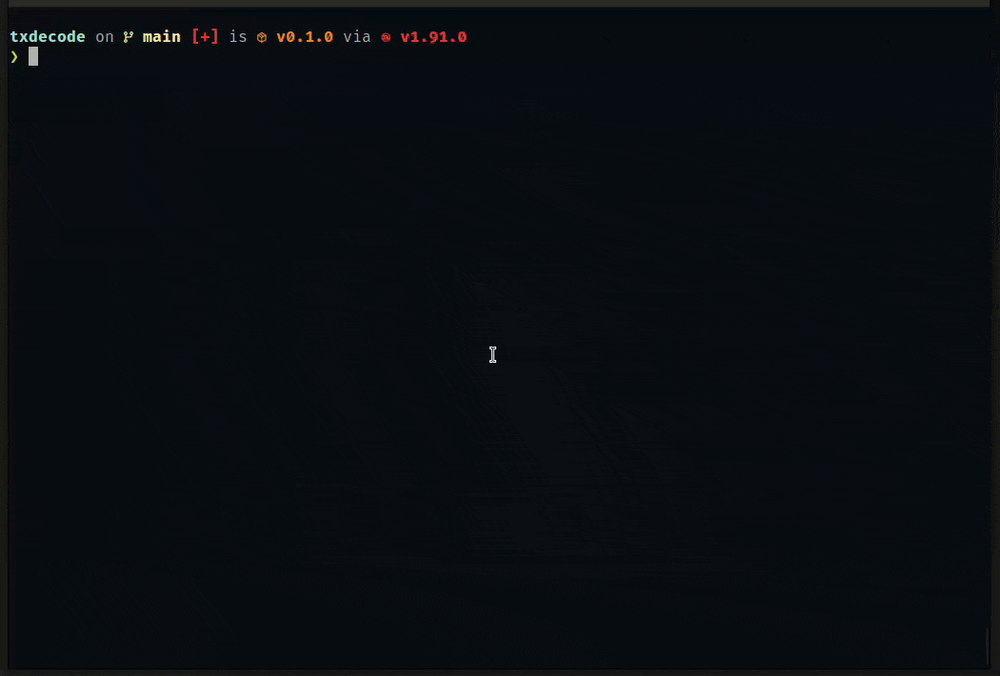

# 🔍 txdecode

A **blazingly fast** EVM transaction decoder CLI built in Rust, powered exclusively by [Alloy](https://github.com/alloy-rs/alloy).

Decode any Ethereum transaction or raw calldata into human-readable function calls and parameters — no more squinting at hex blobs.



---

## ✨ Features

- 🚀 **Automatic function signature detection** via [4byte.directory](https://www.4byte.directory/)
- 🎯 **Smart collision handling** — prioritizes well-known ERC-20/ERC-721 functions over scam signatures
- 🌐 **Multi-chain support** — works on Ethereum, Arbitrum, Base, Optimism, Polygon, and any EVM chain
- 🔗 **Automatic chain detection** — fetches chain ID from RPC endpoint
- 📦 **Etherscan ABI fallback** — fetches verified contract ABIs when 4byte lookup fails
- 💾 **Local ABI cache** — saves fetched ABIs to `~/.txdecode/cache/` for faster repeated lookups
- 🎨 **Beautiful terminal output** — color-coded tables with formatted values
- ⚡ **Pure Alloy** — no legacy dependencies (ethers-rs, web3, etc.)
- 🔒 **Type-safe ABI decoding** with comprehensive error handling

---

## 📦 Installation

### From source (recommended)

```bash
git clone https://github.com/s3bc40/txdecode.git
cd txdecode
cargo build --release
sudo cp target/release/txdecode /usr/local/bin/
```

---

## 🎯 Usage

### Decode a transaction by hash

```bash
# Using default RPC (ethereum-rpc.publicnode.com)
txdecode 0x5c504ed432cb51138bcf09aa5e8a410dd4a1e204ef84bfed1be16dfba1b22060

# Using custom RPC endpoint
txdecode --rpc https://eth.llamarpc.com 0x5c504ed...
```

### Decode raw calldata

```bash
txdecode --input 0xa9059cbb0000000000000000000000000742d35cc6634c0532925a3b844bc9e7595f0beb00000000000000000000000000000000000000000000000000000000000f4240
```

### Use Etherscan fallback for custom contracts

```bash
# Set API key via environment variable
export ETHERSCAN_API_KEY="your_api_key_here"
txdecode 0x1234...abcd

# Or pass it directly
txdecode --etherscan-key YOUR_KEY 0x1234...abcd
```

### Show help

```bash
txdecode --help
```

### Multi-chain support (auto-detects chain ID)

```bash
# Arbitrum
txdecode --rpc https://arb1.arbitrum.io/rpc 0x9368b9...

# Base
txdecode --rpc https://base.drpc.org 0x9b96d6...

# Optimism
txdecode --rpc https://mainnet.optimism.io 0xabc...
```

---

## 🛠️ Tech Stack

| Component                 | Library                              |
| ------------------------- | ------------------------------------ |
| **Ethereum types**        | `alloy::primitives`                  |
| **ABI encoding/decoding** | `alloy::sol_types`, `alloy_json_abi` |
| **RPC provider**          | `alloy::providers`                   |
| **HTTP client**           | `reqwest`                            |
| **Error handling**        | `color-eyre`                         |
| **CLI parsing**           | `clap` v4                            |
| **Pretty tables**         | `comfy-table`                        |

---

## 🧪 Example Output

### Simple ETH transfer

```

📡 Fetched transaction: 0x9de987763c97291e54d9a3aae7c985f1dabbc794e556931f045586ca9af8ca95
From: 0x396343362be2a4da1ce0c1c210945346fb82aa49
To: 0xe688b84b23f322a994a53dbf8e15fa82cdb71127
Value: 11445027713806579 wei

ℹ️ No calldata to decode (empty input).

```

### ERC-20 transfer

```

📡 Fetched transaction: 0x5c504ed432cb51138bcf09aa5e8a410dd4a1e204ef84bfed1be16dfba1b22060
From: 0xa9d1e08c7793af67e9d92fe308d5697fb81d3e43
To: 0x27054b13b1b798b345b591a4d22e6562d47ea75a
Value: 0 wei

✅ Function: transfer
+-----------+---------+--------------------------------------------+
| Parameter | Type | Value |
+==================================================================+
| \_to | address | 0x4fd2b3e5e6f4e4a7c1b1c9d0f9d1a3c5e6f4e4a7 |
|-----------+---------+--------------------------------------------|
| \_value | uint256 | 5_000_000_000 (uint256) |
+-----------+---------+--------------------------------------------+

```

### Raw calldata decode

```

txdecode --input 0xa9059cbb0000000000000000000000000742d35cc6634c0532925a3b844bc9e7595f0beb00000000000000000000000000000000000000000000000000000000000f4240

✅ Function: transfer
+-----------+---------+--------------------------------------------+
| Parameter | Type | Value |
+==================================================================+
| param0 | address | 0x0742d35cc6634c0532925a3b844bc9e7595f0beb |
|-----------+---------+--------------------------------------------|
| param1 | uint256 | 1_000_000 (uint256) |
+-----------+---------+--------------------------------------------+

```

---

## 🗂️ Project Structure

```

txdecode/
├── src/
│ └── main.rs # All-in-one implementation (pre-refactor)
├── Cargo.toml # Dependencies and metadata
├── README.md # This file
└── LICENSE # MIT license

```

**Post-refactor structure (coming soon):**

```

src/
├── main.rs # CLI entry point
├── decode.rs # Core decoding logic
├── signatures.rs # 4byte.directory lookups
├── etherscan.rs # Etherscan/Sourcify API
├── cache.rs # Local file cache
└── display.rs # Pretty table formatting

```

---

## 🧪 Testing

```bash
# Run unit tests
cargo test

# Run with verbose output
cargo test -- --nocapture

# Test specific function
cargo test test_selector_extraction
```

---

## 🤝 Contributing

Contributions are welcome! Please feel free to submit a Pull Request. For major changes, please open an issue first to discuss what you would like to change.

**Development setup:**

```bash
git clone https://github.com/s3bc40/txdecode.git
cd txdecode
cargo build
cargo test
```

---

## 🗺️ Roadmap

### Phase 1: Core Functionality ✅

- [x] Selector extraction
- [x] 4byte.directory API integration
- [x] Dynamic signature parsing
- [x] Collision-resistant decoding
- [x] RPC transaction fetching
- [x] Etherscan ABI fallback
- [x] Local ABI caching
- [x] Pretty terminal output

### Phase 2: Enhancements 🔜

- [x] Refactor into clean modules
- [x] Comprehensive unit tests
- [x] Multi-chain support (Arbitrum, Base, Optimism, Polygon)
- [x] CLI flags for custom RPC, Etherscan key

---

## 📄 License

MIT License - see [LICENSE](LICENSE) file for details

---

## 🙏 Acknowledgments

- **[Alloy](https://github.com/alloy-rs/alloy)** — The modern, high-performance Ethereum library that powers this tool
- **[4byte.directory](https://www.4byte.directory/)** — Community-maintained function signature database
- **[Etherscan](https://etherscan.io/)** — Verified contract ABI source

---

## 💬 Support

- 🐛 [Report a bug](https://github.com/s3bc40/txdecode/issues)
- 💡 [Request a feature](https://github.com/s3bc40/txdecode/issues)
- 📧 Email: s3bc40@gmail.com

---

**Built with ❤️ by [s3bc40](https://github.com/s3bc40)**
